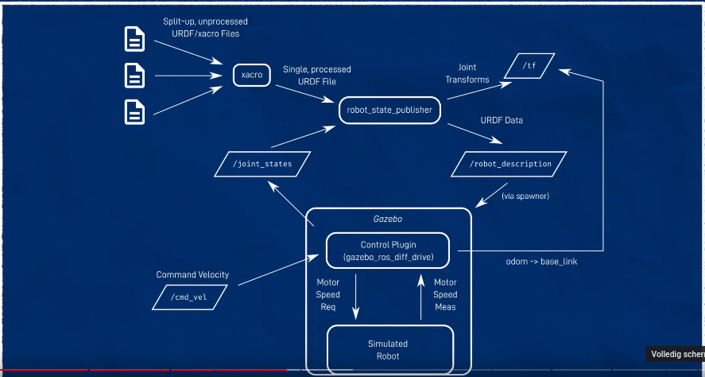

This is a logbook for the work done on the saxibot project.
> ## wednesday, 23 july

- watched video #12/22 titled: *Solving the problem EVERY robot has (with ros2_control)*
- changed my code accordingly and tested that the gazebo is still working


> ## tuesday, 22 july 2024
Added the modeling via ROS2/Gazebo (humble) to the confluence page
Got confirmation that the parts I ordered are approved by Abeje, only regarding the motors: 1 is in stock, the other will arrive in september.. nothing to do about that!

[See this link](https://mechatronica.atlassian.net/wiki/spaces/SaxiBot/pages/3294527497/ROS2+and+Gazebo) for the Confluence subpage on ROS2 and Gazebo for the **humble** ros2 version, and the classis gazebo (version 11)

> ## monday, 21 july 2024
Some reading and ordering parts by myself outside of SMART:
parts ordered:
 - **electronicavoorjou\.nl** (€25.73, incl.)
   - Buck converter XL4016E1 (€7.95)
   - USB naar UART TTL kabel - PL2303HZ (€4.95)
   - male 2.1'' (5.5mm) DC power jack adapter connector plug (€1.95)
   - HDMI to uHDMI adapter (€5.95)
 - **electronicavoorjou\.nl (deel 2)** (€12.94, incl.)
   - Stroom en spanningsmeter 100V 50A (€8.95)
 - **vanallesenmeer\.nl** (€13.80, incl.)
   - (4 kleuren, rgby) Schakelaar aan/uit rond verlicht 12V 20A (4x€1.75)
   - zekeringhouder 5x20mm inbouw (€0.85)
   - automatische zekeringen 15A MR1 (€2.15)
   - zekeringhouder in-line 5x20 glaszekering (€0.85)

This components are all part of the power distribution chain.

With help from Gerjen I have been looking for a **power supply** and found a **Tattu LiPo** battery which is used by **spotter** acccording to the label on it. Since it was completely drained Gerjen and Mark showed me how to recharge it.

## recharging lipo
### very empty
inn this case the lipo 3S was very empty. As known is that one of the benefits of a LiPo battery is that the output voltage remains relatively constant before dropping off steeply. If this depletion goes to far, the lipo might become permanently damaged. However, a good try is to:
1. charge with a very low current (i.e., 0.1*C)
   1. the mode is ....(ask mark)
2. when the voltage is about 9 V - or something - the normal charging may be assumed. That is about 1C


> ## wednesday, 17 july 2024
Made some small tweaks to the launchers in python and committed it

> ## tuesday, 16 july 2024

## video #3: *Driving your virtual robot!*

### (separate running) robot state publisher
to start the robot state publisher (rsp)
`ros2 launch saxibot rsp.launch.py [use_sim_time:=true]`
- `saxibot` is the package in which the launch file `rps.launch.py` is found

-- new terminal --
start gazebo:
`ros2 launch gazebo_ros gazebo.launch.py`
- `gazebo_ros` is again the package in which the gazebo launch file is found
- 
-- new terminal --
spawn the saxibot:
`ros2 run gazebo_ros spawn_entity.py -topic robot_description -entity saxibot`
`-topic robot_description` gives the topic where the robot is found
`-entity saxibot` is the name of the object model


### integrated launcher
make a launcher `sim_launcher.launch.py` which include rsp.launch.py **and** runs gazebo **and** 
runs the spawner script in 1 go
to include other launch file:

```
package_name = 'saxibot'  # must be set correctly, can be a global maybe??
incfile = os.path.join(get_package_share_directory(package_name), 'launch', 'rps.launch.py')
rsp = IncludeLaunchDescription(PythonLaunchDescriptionSource([incfile]),
                               launch_arguments={'use_sim_time': 'true'}.items())
```

to run the spawner which is **not** a launcher:
```
spawn_entity = Node(package='gazebo_ros',
                    executable='spawn_entity.py',
                    arguments=['-topic', 'robot_description',
                               '-entity', 'saxibot'],
                    output='screen')
```

### moving it around
picture:


- command velocity is in topic */cmd_vel* and the type is *twist*
  - vx, vy, vz, rx, ry, rz. Only vx and rz are nonzero
- gazebo uses a *control plugin* called **gazebo_ros_diff_drive** to command and measure the motor speed of the simulated robot
  - note that all these specific plugins will be replaced by **ros2_control** at a later stage. This is the default for future packages
- the robot is *spawned* from the topic */robot_description*
- gazebo is in control of the joint states and therefore **joint_state_publisher_gui** is not required anymore
  - the topic */joint_states* subscribe to the control plugin
  - control plugin broadcasts a new frame *odom*, it is the world start position.

#### control plugin (libgazebo_ros_diff_drive.so)
Now, a new **xacro** for for the gazebo plugin *libgazebo_ros_diff_drive.so* is made, which is the 
plugin for the control of the differential drive wheels. It needs parameters to be able to calculate 
the speed and rotation, so distances and diameters.

In addition, the **odometry** will be calculated and published to a frame (called *odom* here, but 
this might be anything) and the TF and wheel TF will be updated as well.

### tele-operation via keyboard
Now, the set the **tele-operation** or *teleop* via the keyboard run:
`ros2 run teleop_twist_keyboard teleop_twist_keyboard`

I assume this connects the keyboard to the */cmd_vel* topic which is taken as the input for the 
control plugin *libgazebo_ros_diff_drive.so*

Otherwise the topic /cmd_vel is dead!

> **tips**: 
> 1. use `ros2 topic list` to get the full topics available
> 2. use `ros2 topic echo <topic>` to show the messages being published
> 3. to use a configuration in rviz: `rviz2 -d src/saxibot/config/xxxx.rviz`
> 4. to use a world in gazebo: `ros2 launch saxibot <launchfile> world:=src/saxibot/worlds/xxxx.world`
>   1. note that the saxibot itself should be removed since it will spawn via the same launch script!

